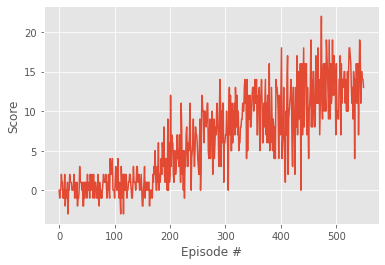

# Deep Reinforcement Learning : Project 1:Navigation Report
Author: [Shantanu Biswas] 

## About Deep Reinforcement Learning Terminologies

 - Reinforcement Learning refers to a Machine Learning paradigm where an agent learns to attain a goal or set of goals by interacting with an environment. 
 - The agent interacts with the environment through a series of states and actions and is rewarded by the environment. The agent does not know what action to take for which state. It learns by accumulating rewards. The way in which an agent learns to navigate in an environment is by maximizing its current and all future rewards.
 - Reinforcement Learning have been extensively used in training programs to play games, the most celebrated among them being AlphaGo which beat the world leader in the ancient oriental game of Go.
 - Deep Reinforcement Learning, harnesses the power of neural networks with the algorithms of reinforcement learning.
 - An excellent example of deep reinforcement learning is Deep Q-learning, which surpassed human-level performance in Atari games.
 - Deep Q-Learning, applies the idea of Q-Learning to neural networks. The idea of Q-learning is to learn the action-value function, often denoted as Q(s, a) , where s represents the current state and a represents the action being evaluated. 

  

 - Q-learning is a form of Temporal-Difference learning (TD-learning), where unlike Monte-Carlo methods, we can learn from each step rather than waiting for an episode to complete. The idea is that once we take an action and are thrust into a new state, we use the current Q-value of that state as the estimate for future rewards.
 - Double DQN
  - The popular Q-learning algorithm is known to overestimate action values under certain conditions. 
  - DQNs are known to overestimate the value function because of the max operator.  
  - The idea of Double DQN is to disentangle the calculation of the Q-targets into finding the best action and then calculating the Q-value for that action in the given state. The trick then is to use one network to choose the best action and the other to evaluate that action.  

   
  
 - Dueling DQN
  - Normally, DQNs have a single output stream with the number of output nodes equal to the number of actions. But this could lead to unnecessarily estimating the value of all the actions for states for states which are clearly bad and where, choosing any action won't matter that much.
  - One stream outputs a single scalar value denoting the value function for that state, V(s) while the other stream outputs the advantage function for each action in that state A(a, s). The advantage function accounts for the advantage achieved for choosing action a . They are combined together using a special aggregrate layer:

 $$ Q (s, a) = V(s) + (A(s, a) - 1/A * mean_a (A (s, a))$$
 
 - Prioritized experience replay
  - Experience replay lets online reinforcement learning agents remember and reuse experiences from the past. 
  - This is the other important technique used for stabilizing training. If we keep learning from experiences as they come, then we are basically observed a sequence of observations each of which are linked to each other.  
  - In prior work, experience transitions were uniformly sampled from a replay memory. However, this approach simply replays transitions at the same frequency that they were originally experienced, regardless of their significance. 
  
  
## Project's goal

In this project, the goal is to train an agent to navigate a virtual world and collect as many yellow bananas as possible while avoiding blue bananas

 

## Environment details

The environment is based on Unity ML-agents
Note: The project environment provided by Udacity is like, but not identical to the Banana Collector environment on the Unity ML-Agents GitHub page.
The Unity Machine Learning Agents Toolkit (ML-Agents) is an open-source Unity plugin that enables games and simulations to serve as environments for training intelligent agents. Agents can be trained using reinforcement learning, imitation learning, neuroevolution, or other machine learning methods through a simple-to-use Python API.

A reward of +1 is provided for collecting a yellow banana, and a reward of -1 is provided for collecting a blue banana. Thus, the goal of the agent is to collect as many yellow bananas as possible while avoiding blue bananas.
The state space has 37 dimensions and contains the agent's velocity, along with ray-based perception of objects around the agent's forward direction.
Given this information, the agent has to learn how to best select actions. Four discrete actions are available, corresponding to:
- **`0`** - move forward.
- **`1`** - move backward.
- **`2`** - turn left.
- **`3`** - turn right.

The task is episodic, and in order to solve the environment, the agent must get an average score of +13 over 100 consecutive episodes.

## Learning Algorithm

To watch a trained smart agent, follow the instructions below:
 - DQN: If you want to run the original DQN algorithm, use the checkpoint dqn.pth for loading the trained model. Also, choose the parameter qnetwork as QNetwork while defining the agent and the parameter update_type as dqn.
 - Double DQN: If you want to run the Double DQN algorithm, use the checkpoint double_dqn.pth for loading the trained model. Also, choose the parameter qnetwork as QNetwork while defining the agent and the parameter update_type as double_dqn.
 - Dueling Double DQN: If you want to run the Dueling Double DQN algorithm, use the checkpoint duelling_dqn.pth for loading the trained model. Also, choose the parameter qnetwork as DuelingQNetwork while defining the agent and the parameter update_type as double_dqn.
 
### Hyperparameters

The number of training episodes was fixed at 5000. While the maximum number of time steps per episode was fixed at 2000. These were done according to best practices, optimized parameters which give enough time for the agent to learn in an episodic manner.

The epsilon-Greedy policy iteration was used to converge to the optimal policy. In keeping with the conditions of Greedy in the Limit with Infinite Exploration, the epsilon value was set to decay with time step. The starting and ending values of epsilon were however fixed to 1.0 and 0.1 respectively, so as to ensure that it does not decay to too low a value. The decay rate was set to 0.995.

### Description
 - dqn_agent.py: code for the agent used in the environment
 - model.py: code containing the Q-Network used as the function approximator by the agent
 - Navigation_EnvironmentExploration.ipynb: explore the unity environment and verify the setup
 - Navigation_Solution.ipynb: notebook containing the solution (Each cell to be executed to train the agent)
 - Navigation_Pixels.ipynb: notebook containing the code for the pixel-action problem (Optional)
 - dqn.pth: saved model weights for the original DQN model
 - double_dqn.pth: saved model weights for the Double DQN model
 - duelling_dqn.pth: saved model weights for the Dueling DQN model
 - Report.md: The submission includes a file in the root of the GitHub repository that provides a description of the implementation.
 
 
### Results/ Plot of Rewards
Plot showing the score per episode over all the episodes.
The best performance was achieved by Double DQN where the reward of +13 was achieved in 355 episodes. 

| Double DQN                                 | DQN                                | Dueling DQN                                         |
| ------------------------------------------ | ---------------------------------- | --------------------------------------------------- |
|  |  |  |

### Ideas for future work
 - In this project we tried a DQN network, and  included some features of Double DQN and some features of Duelling DQN
 - We can implement algorithms such as Prioritized Experience Replay, Duelling, Rainbow to get better results.
  - For implementing Prioritized Experience Replay we can use the Sum Tree data structure as it helps in a faster implementation of Prioritized Experience Replay.
 - We tried with different sets of hyper-parameters, but a systematic search through a field of           hyper-parameter values can yield model which would perform better.
 - We have tried a basic. CNN architecture. We can try more advaned CNN architectures like repurposing Alexnet or GoogleNet. 

